# VisionCare – Clean Architecture & Design Patterns

## Mục tiêu thuyết trình
- Giải thích vì sao dự án áp dụng Clean Architecture và lợi ích đối với VisionCare.
- Minh hoạ luồng nghiệp vụ chính (đặt lịch & thanh toán VNPay) bằng sơ đồ Mermaid.
- Làm rõ các design pattern đang dùng và tác động của chúng.
- Chuẩn bị script thuyết trình giúp khán giả dễ theo dõi.

## Cấu trúc 4 tầng Clean Architecture

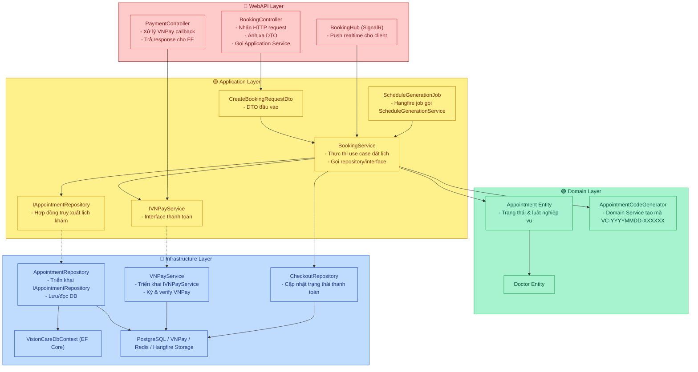

- **Domain Layer (`be/src/Domain`)**  
  Chứa entity thuần C#, value object, domain service (`AppointmentCodeGenerator`). Không phụ thuộc framework hay tầng ngoài.
- **Application Layer (`be/src/Application`)**  
  Định nghĩa use case qua service (`BookingService`, `ScheduleGenerationService`), DTO, validator và **các interface dùng chung** (ví dụ `IAppointmentRepository`, `IVNPayService`) để tầng Infrastructure implement thông qua DI.
- **Infrastructure Layer (`be/src/Infrastructure`)**  
  Thực thi interface từ Application: repository EF Core (`AppointmentRepository`), mapper (`AppointmentMapper`), adapter thanh toán (`VNPayService`), background integration (Hangfire, Redis).
- **WebAPI Layer (`be/src/WebAPI`)**  
  Expose REST & SignalR: controller (`BookingController`), middleware auth, cấu hình DI (`Program.cs`) kết nối bên ngoài. Đây là gateway giữa client và hệ thống.

> React FE vẫn tồn tại nhưng nằm ngoài sơ đồ Clean Architecture backend; FE tương tác với WebAPI qua HTTP/SignalR.

## Nguyên lý trọng tâm
- **Dependency Rule**: `WebAPI` biết `Application`, nhưng `Application` chỉ thấy `Domain` & interface; `Infrastructure` implement interface từ `Application`.
- **Use Case First**: Business flow được gom trong service lớp Application (`BookingService`, `ScheduleGenerationService`).
- **Testability**: Các repository & service được mock thông qua interface => dễ unit test (thư mục `tests/`).
- **Replaceability**: VNPay hoặc storage có thể thay thế bằng dịch vụ khác chỉ cần implement cùng interface.

## Ví dụ feature: Đặt lịch khám với VNPay

### 1. Dòng chảy qua 4 tầng

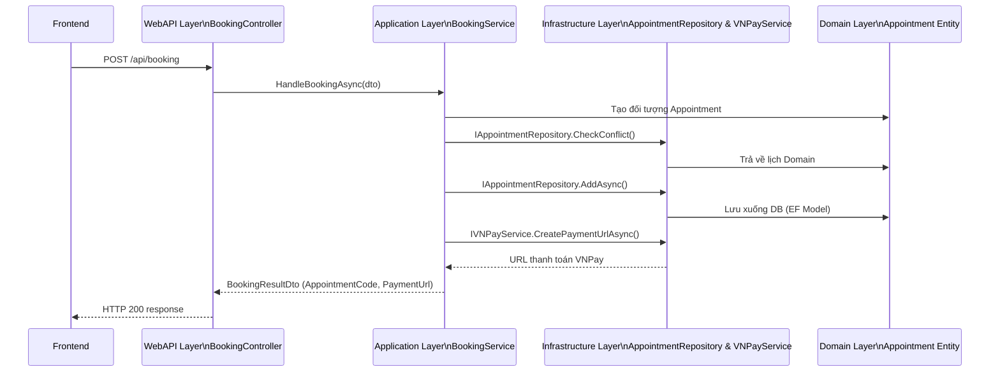

### 2. Callback thanh toán (WebAPI ↔ Application ↔ Infrastructure)

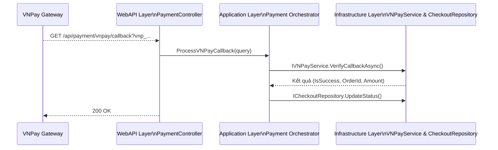

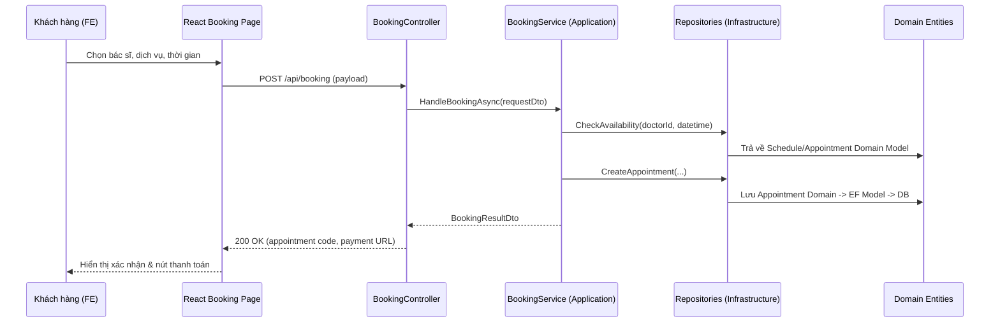

### 2. Thanh toán VNPay callback

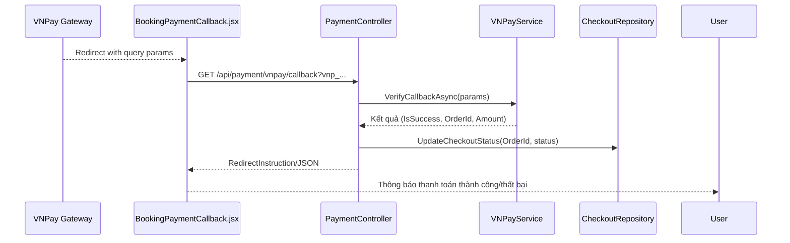

## Design Pattern Quan Trọng Nhất: Repository Pattern

### 🏆 Tại sao Repository Pattern là quan trọng nhất?

**Repository Pattern** là nền tảng của Clean Architecture trong VisionCare vì:

1. **Tách biệt hoàn toàn Business Logic và Data Access**
   - Application layer chỉ biết interface (`IAppointmentRepository`, `IDoctorRepository`...)
   - Không phụ thuộc vào EF Core, SQL, hay bất kỳ ORM nào
   - Business logic thuần túy, dễ đọc và bảo trì

2. **Tuân thủ Dependency Inversion Principle (DIP)**
   - Application định nghĩa contract (interface)
   - Infrastructure implement contract
   - Dependency flow: Application → Interface ← Infrastructure

3. **Testability cực cao**
   - Dễ dàng mock repository trong unit test
   - Test business logic mà không cần database thật
   - Tăng tốc độ test và độ tin cậy

4. **Linh hoạt thay đổi persistence layer**
   - Có thể đổi từ PostgreSQL sang MongoDB, Redis, hay API external
   - Chỉ cần implement lại interface, không sửa Application code

5. **Quy mô lớn trong dự án**
   - **36+ repository interfaces** trong Application layer
   - Mọi service đều phụ thuộc vào repository
   - Pattern được áp dụng nhất quán toàn hệ thống

### 📊 Sơ đồ Repository Pattern trong VisionCare

#### 1. Kiến trúc tổng quan Repository Pattern

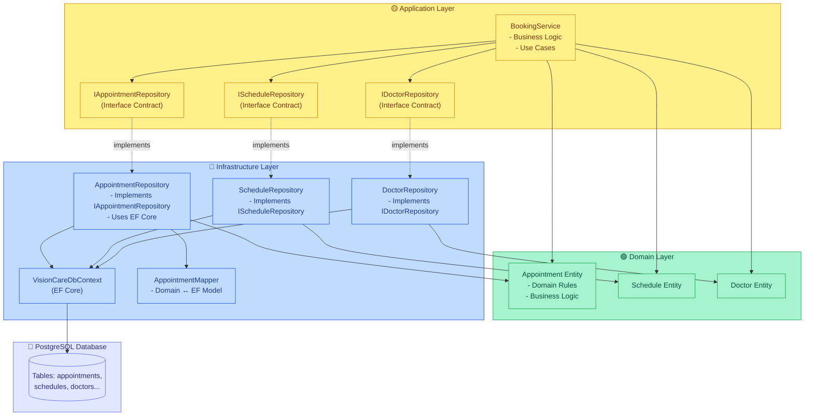

### 💡 Ví dụ cụ thể: BookingService sử dụng Repository

```csharp
// Application/Services/Booking/BookingService.cs
public class BookingService : IBookingService
{
    // Inject repository qua INTERFACE, không phải implementation
    private readonly IAppointmentRepository _appointmentRepository;
    private readonly IScheduleRepository _scheduleRepository;
    private readonly IDoctorRepository _doctorRepository;

    public BookingService(
        IAppointmentRepository appointmentRepository,
        IScheduleRepository scheduleRepository,
        IDoctorRepository doctorRepository
    )
    {
        _appointmentRepository = appointmentRepository;
        _scheduleRepository = scheduleRepository;
        _doctorRepository = doctorRepository;
    }

    public async Task<BookingResult> CreateBookingAsync(CreateBookingRequest request)
    {
        // Business logic: Kiểm tra availability
        var isAvailable = await _scheduleRepository
            .IsScheduleAvailableAsync(request.DoctorId, request.SlotId, request.Date);
        
        if (!isAvailable)
            throw new ValidationException("Slot không còn trống");

        // Business logic: Tạo appointment
        var appointment = new Appointment { /* ... */ };
        await _appointmentRepository.AddAsync(appointment);

        return new BookingResult { /* ... */ };
    }
}
```

**Điểm quan trọng:**
- `BookingService` không biết gì về EF Core, SQL, hay PostgreSQL
- Chỉ cần biết interface `IAppointmentRepository` có method `AddAsync()`
- Infrastructure layer tự lo việc map Domain → EF Model → Database

#### 2. Sequence Diagram: Luồng tạo Booking với Repository Pattern

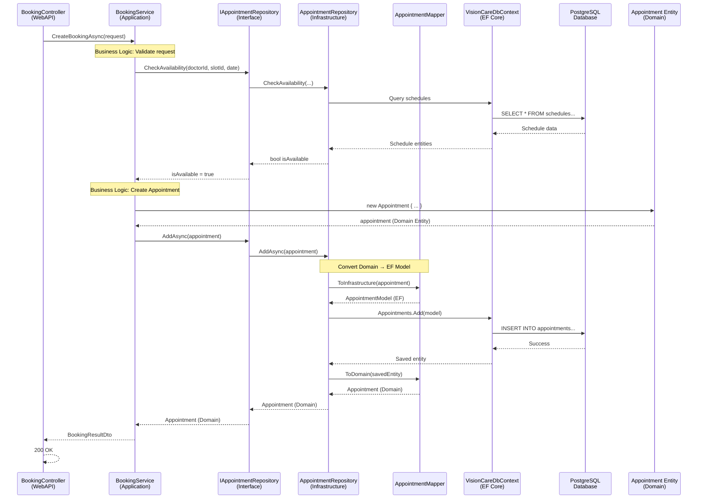

**Giải thích luồng:**
1. **Controller** nhận request từ client
2. **Service** (Application layer) xử lý business logic, chỉ gọi qua **Interface**
3. **Repository** (Infrastructure) implement interface, sử dụng **Mapper** để convert
4. **DbContext** (EF Core) tương tác với **Database**
5. Dữ liệu quay lại qua Domain Entity, không phải EF Model

#### 3. Class Diagram: Cấu trúc Repository Pattern

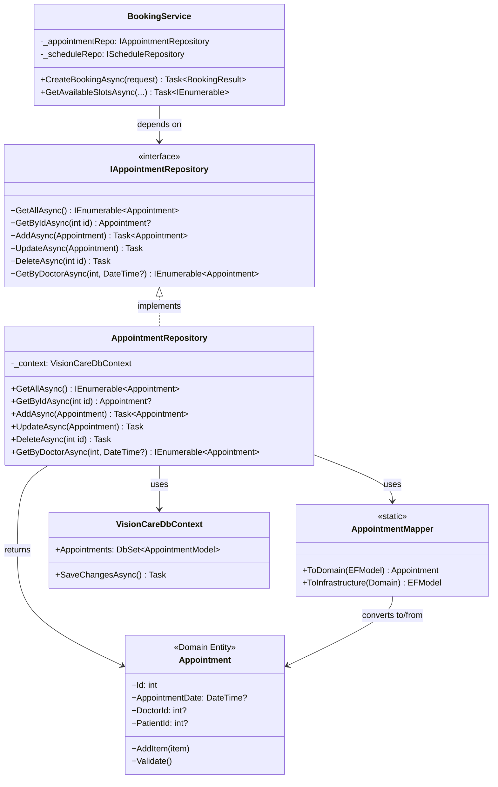

**Giải thích:**
- **Interface** (`IAppointmentRepository`) định nghĩa contract ở Application layer
- **Implementation** (`AppointmentRepository`) ở Infrastructure layer
- **Service** chỉ phụ thuộc vào interface, không biết implementation
- **Mapper** chuyển đổi giữa Domain Entity và EF Model

#### 4. So sánh: Có Repository vs Không có Repository

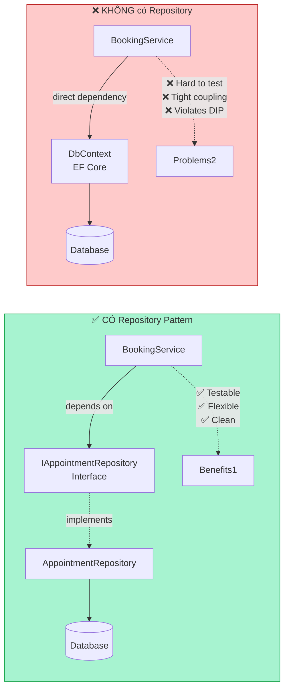

**Lợi ích khi có Repository:**
- ✅ **Testable**: Mock interface dễ dàng
- ✅ **Flexible**: Đổi database không ảnh hưởng business logic
- ✅ **Clean**: Tuân thủ Dependency Inversion Principle
- ✅ **Maintainable**: Tách biệt rõ ràng giữa các layer

#### 5. Dependency Injection Flow với Repository

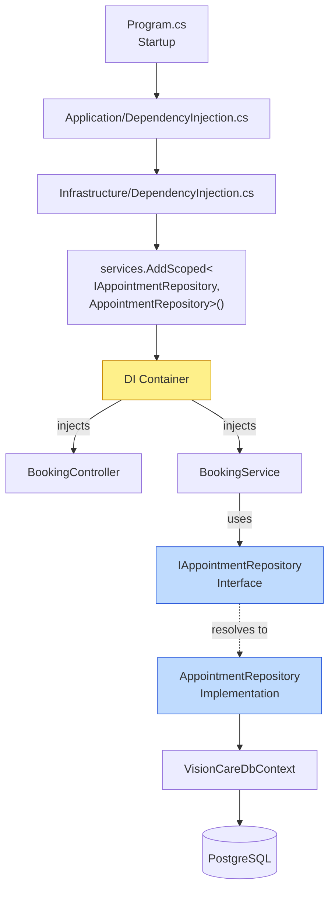

**Giải thích DI Flow:**
1. **Program.cs** gọi `AddApplication()` và `AddInfrastructure()`
2. **DependencyInjection.cs** đăng ký: `IAppointmentRepository` → `AppointmentRepository`
3. **DI Container** tự động inject vào constructor của `BookingService`
4. **BookingService** nhận được `AppointmentRepository` nhưng chỉ biết qua interface
5. Khi runtime, DI container resolve implementation thực tế

### 📈 Thống kê Repository Pattern trong VisionCare

- **36+ Repository Interfaces** trong `Application/Interfaces/`
- **36+ Repository Implementations** trong `Infrastructure/Repositories/`
- **100% Services** sử dụng repository pattern
- **0 direct database access** từ Application layer

### ✅ Lợi ích thực tế

1. **Onboarding dev mới**: Dễ hiểu vì pattern nhất quán
2. **Unit testing**: Mock repository trong 5 phút
3. **Thay đổi database**: Chỉ sửa Infrastructure, Application không đổi
4. **Code review**: Dễ review vì tách biệt rõ ràng
5. **Performance**: Có thể cache ở repository level mà không ảnh hưởng business logic

---

## Design Patterns trong VisionCare

| Pattern | Mục đích | Hiện diện trong dự án | Giải thích |
| --- | --- | --- | --- |
| **Repository** ⭐ | Tách persistence khỏi domain | `Infrastructure/Repositories/*Repository.cs` | **Pattern quan trọng nhất** - 36+ repositories, nền tảng của Clean Architecture |
| **Data Mapper** | Chuyển đổi model giữa tầng | `Infrastructure/Mappings/*Mapper.cs`, `Application/Mappings/MappingProfile.cs` | Mapper biến EF model ↔ Domain entity, giúp Domain thuần C#. |
| **Service Layer / Use Case** | Gom nghiệp vụ thành use case | `Application/Services/*Service.cs` | `BookingService`, `ScheduleGenerationService`, `AuthService` triển khai logic nghiệp vụ tập trung. |
| **Dependency Injection + Interface (Inversion of Control)** | Giảm coupling, thay thế dễ | `Application/DependencyInjection.cs`, `Infrastructure/DependencyInjection.cs`, `Program.cs` | Interface nằm ở Application, Implementation được đăng ký (Scoped/Singleton) ở Infrastructure/WebAPI. |
| **Singleton** | Một instance duy nhất dùng chung | `Infrastructure/DependencyInjection.cs` với `AddSingleton<IJwtTokenService, JwtTokenService>()` | Bảo đảm việc phát JWT thống nhất toàn hệ thống. |
| **Adapter** | Chuyển đổi interface không tương thích | `Infrastructure/Services/Payment/VNPayService.cs` (triển khai `IVNPayService`) | Bọc SDK VNPay, cung cấp API nội bộ tạo URL & verify callback. |
| **Observer (Pub/Sub)** | Phát sự kiện tới nhiều client | `WebAPI/Hubs/BookingHub.cs`, `CommentHub.cs` | SignalR giúp thông báo realtime khi lịch/ bình luận thay đổi. |
| **Strategy (Thông qua FluentValidation)** | Hoán đổi thuật toán/logic linh hoạt | `Application/Validators/*.cs` | Mỗi validator là một chiến lược kiểm tra DTO khác nhau, tiêm bằng DI. |
| **Command (Job + Background Task)** | Đóng gói hành động thành object | `Application/Services/Scheduling/ScheduleGenerationJob` + Hangfire Scheduler | Job biểu diễn “Generate schedules” và có thể được enqueue/retry như command. |

> Những pattern như Builder, Decorator, Proxy hiện chưa có implementation rõ ràng trong dự án. Nếu muốn áp dụng (ví dụ builder cho email template, decorator cho logging middleware chuyên biệt), có thể bổ sung sau.

## Observer Pattern trong VisionCare: SignalR Real-time Notifications

### 📡 Observer Pattern với SignalR

VisionCare sử dụng **Observer Pattern** thông qua SignalR để gửi thông báo real-time cho nhiều clients khi có sự kiện xảy ra (đặt lịch, bình luận blog).

### 🏗️ Kiến trúc Observer Pattern

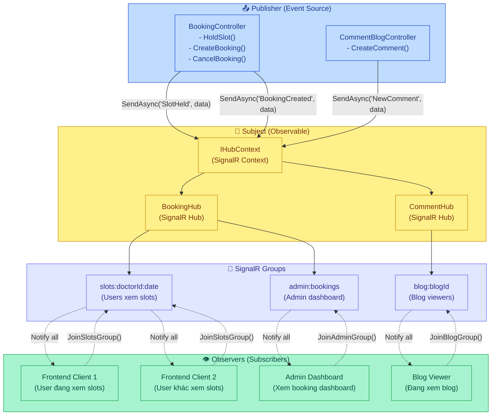

### 📊 Sequence Diagram: Luồng Observer Pattern

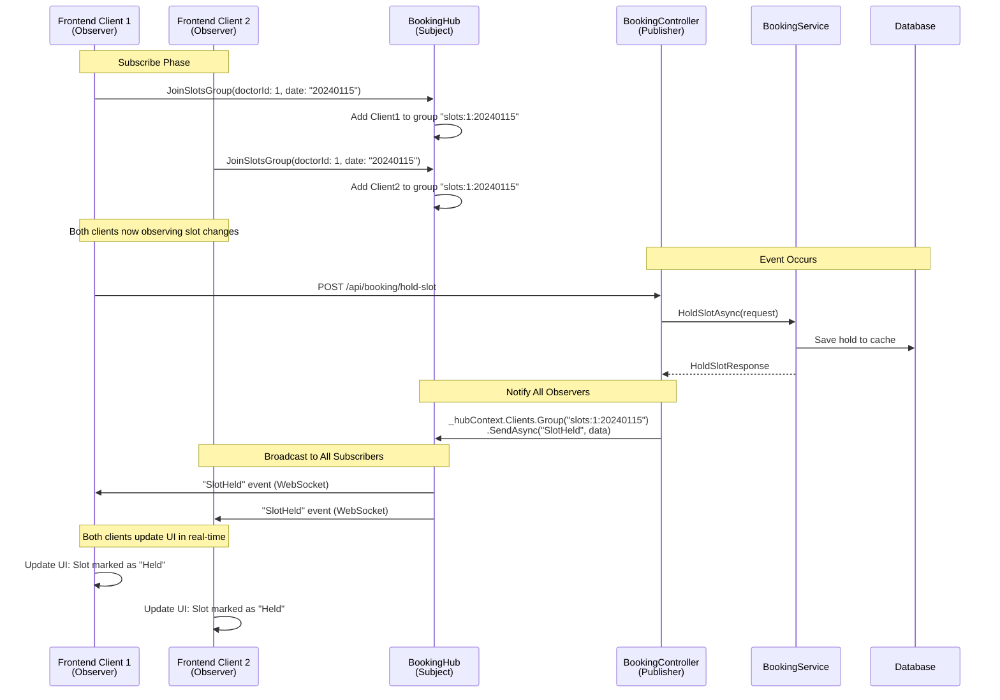

### 💡 Ví dụ Code: Observer Pattern trong Action

**1. Subject (BookingHub) - Quản lý Observers:**
```csharp
// WebAPI/Hubs/BookingHub.cs
public class BookingHub : Hub
{
    // Observer subscribe vào group
    public async Task JoinSlotsGroup(int doctorId, string date)
    {
        var groupName = $"slots:{doctorId}:{date}";
        await Groups.AddToGroupAsync(Context.ConnectionId, groupName);
    }
}
```

**2. Publisher (BookingController) - Phát sự kiện:**
```csharp
// WebAPI/Controllers/BookingController.cs
[HttpPost("hold-slot")]
public async Task<ActionResult<HoldSlotResponse>> HoldSlot([FromBody] HoldSlotRequest request)
{
    var response = await _bookingService.HoldSlotAsync(request);
    
    // Notify all observers in group
    var groupName = $"slots:{request.DoctorId}:{request.ScheduleDate:yyyyMMdd}";
    await _hubContext.Clients.Group(groupName).SendAsync("SlotHeld", new {
        doctorId = request.DoctorId,
        slotId = request.SlotId,
        date = request.ScheduleDate.ToString("yyyyMMdd"),
        holdToken = response.HoldToken
    });
    
    return Ok(response);
}
```

**3. Observer (Frontend) - Nhận thông báo:**
```javascript
// fe/src/hooks/useBooking.js
const connection = new signalR.HubConnectionBuilder()
    .withUrl("/hubs/booking")
    .build();

// Subscribe vào group
await connection.invoke("JoinSlotsGroup", doctorId, date);

// Lắng nghe sự kiện
connection.on("SlotHeld", (data) => {
    // Update UI khi có slot bị hold
    setSlots(prevSlots => 
        prevSlots.map(slot => 
            slot.id === data.slotId 
                ? { ...slot, status: "held" }
                : slot
        )
    );
});
```

### ✅ Lợi ích Observer Pattern trong VisionCare

1. **Real-time Updates**: Users thấy thay đổi ngay lập tức, không cần refresh
2. **Decoupling**: Controller không cần biết có bao nhiêu clients đang lắng nghe
3. **Scalable**: Có thể thêm nhiều observers mà không sửa code Publisher
4. **Group-based**: Chỉ notify những clients quan tâm (theo doctorId, date, blogId)
5. **Automatic Cleanup**: SignalR tự động remove observer khi disconnect

### 🔄 So sánh: Observer Pattern vs Polling

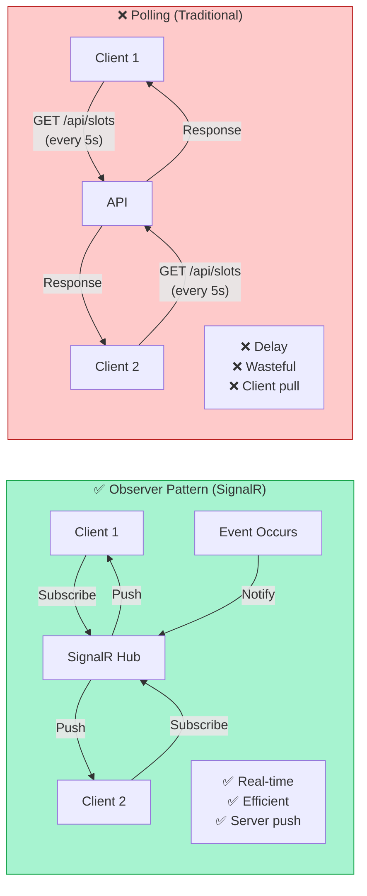

**Observer Pattern tốt hơn vì:**
- ✅ **Real-time**: Thông báo ngay khi có sự kiện
- ✅ **Efficient**: Không cần polling liên tục
- ✅ **Server push**: Server chủ động gửi, không đợi client hỏi

## Liên kết Frontend với Clean Architecture
- FE chỉ gọi endpoint qua lớp service (`fe/src/services/bookingService.js`…), không biết về DB.
- React Context quản lý trạng thái đăng nhập (`AuthContext`), hooks (`useBooking`) điều phối gọi API.
- Component `BookingPaymentCallback.jsx` xử lý redirect từ VNPay, đọc query string và hiển thị kết quả.
- Lợi ích: Dễ thay backend khác mà không ảnh hưởng cấu trúc component, chỉ cần update service layer FE.

## Script gợi ý cho thuyết trình (10-12 phút)

1. **Mở bài (1 phút)**  
   - Giới thiệu nhóm & bài toán VisionCare.  
   - Đặt mục tiêu: đảm bảo khả năng mở rộng, dễ bảo trì.

2. **Clean Architecture là gì? (2 phút)**  
   - Trình chiếu sơ đồ layer (Mermaid).  
   - Nhấn mạnh nguyên lý Dependency Rule, Use Case-centric, testability.

3. **Ánh xạ vào VisionCare (3 phút)**  
   - Đi từ Domain → Application → Infrastructure → WebAPI → React FE.  
   - Ví dụ cụ thể: `BookingService` gọi `AppointmentRepository`.  
   - Nêu lợi ích khi thay đổi DB hoặc nhà cung cấp thanh toán.

4. **Luồng nghiệp vụ trọng điểm (3 phút)**  
   - Sử dụng sequence thứ nhất giải thích quy trình đặt lịch.  
   - Sequence thanh toán VNPay cho thấy vai trò adapter.  
   - Flow Hangfire thể hiện cross-cutting concern.

5. **Design Pattern Quan Trọng Nhất: Repository Pattern (3 phút)**  
   - **Nhấn mạnh**: Repository Pattern là nền tảng của Clean Architecture
   - Trình chiếu sơ đồ Mermaid minh họa cách Repository hoạt động
   - Giải thích 5 lý do tại sao quan trọng (tách biệt, DIP, testability, linh hoạt, quy mô)
   - Ví dụ code `BookingService` sử dụng repository
   - Thống kê: 36+ repositories, 100% services sử dụng
   - Lợi ích thực tế: onboarding, testing, thay đổi DB

6. **Các Design Patterns khác (1 phút)**  
   - Trình bày nhanh bảng pattern còn lại (Adapter, Singleton, Strategy, Observer...)
   - Nhấn mạnh Repository là quan trọng nhất, các pattern khác hỗ trợ

7. **Frontend góc nhìn Clean Architecture (1 phút)**  
   - FE tôn trọng boundary, dùng service + context.  
   - Lợi ích khi backend thay đổi.

8. **Kết luận & Q&A (1 phút)**  
   - Tổng kết: Repository Pattern là nền tảng, giúp đạt 3 mục tiêu: maintainability, scalability, testability.  
   - Mời đặt câu hỏi.

## Tips khi trình bày
- **Nhấn mạnh Repository Pattern**: Đây là pattern quan trọng nhất, dành 3 phút để giải thích kỹ
- Chuẩn bị demo nhanh (ví dụ đặt một lịch trên FE) rồi quay lại slide để phân tích layer tương ứng
- Khi trình bày Repository Pattern, chỉ vào sơ đồ Mermaid và giải thích:
  - Application chỉ biết interface
  - Infrastructure implement interface
  - Dependency flow: Application → Interface ← Infrastructure
- Nhấn mạnh lợi ích thực tế: 
  - Onboarding dev mới dễ vì pattern nhất quán
  - Unit test dễ vì mock repository
  - Thay database chỉ sửa Infrastructure
- Giữ slide trực quan: chuyển giữa sơ đồ Mermaid và bảng pattern, hạn chế chữ dài
- Có thể phát handout đường link tới tài liệu `.md` này để người nghe xem lại

---

> *Tài liệu này nằm ở `docs/visioncare-clean-architecture.md`. Cập nhật thêm ví dụ code hoặc hình ảnh theo nhu cầu thuyết trình.*

